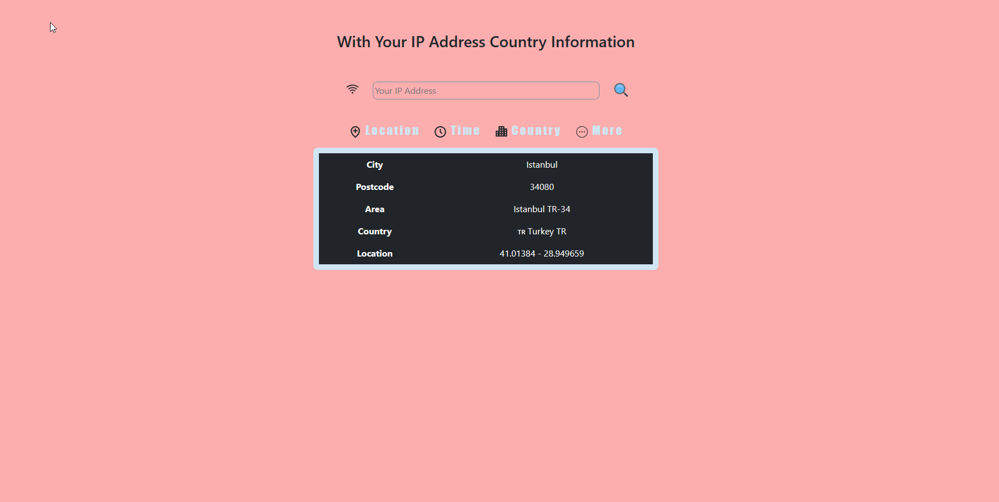
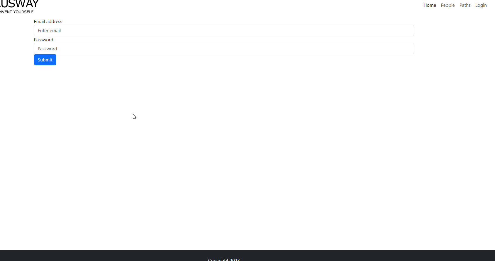
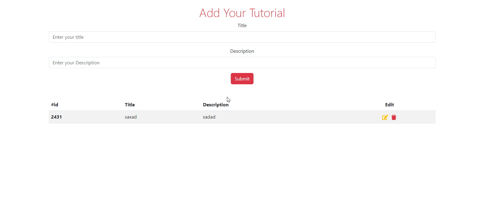
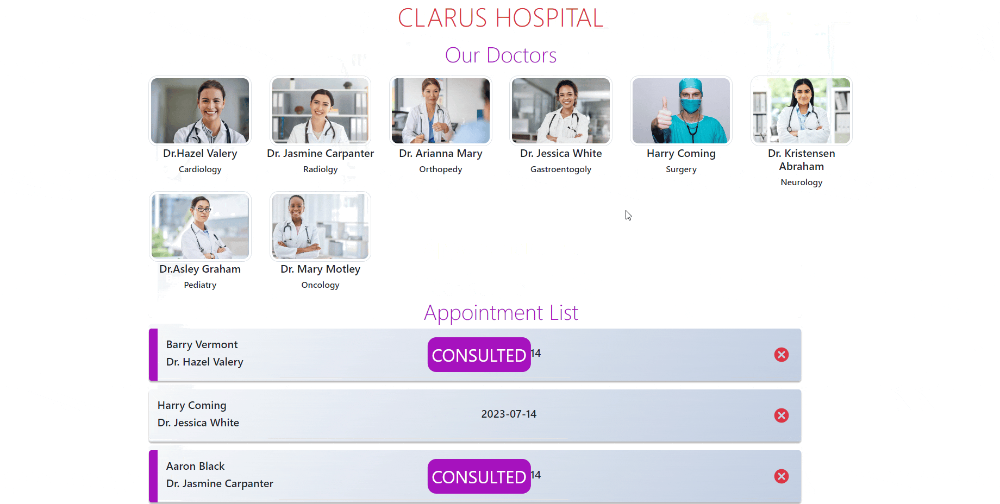
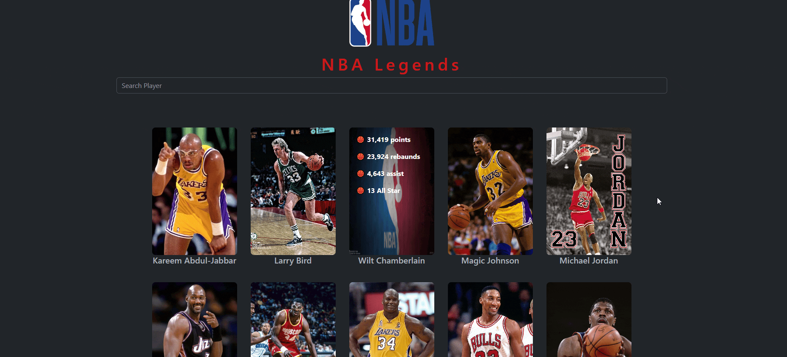
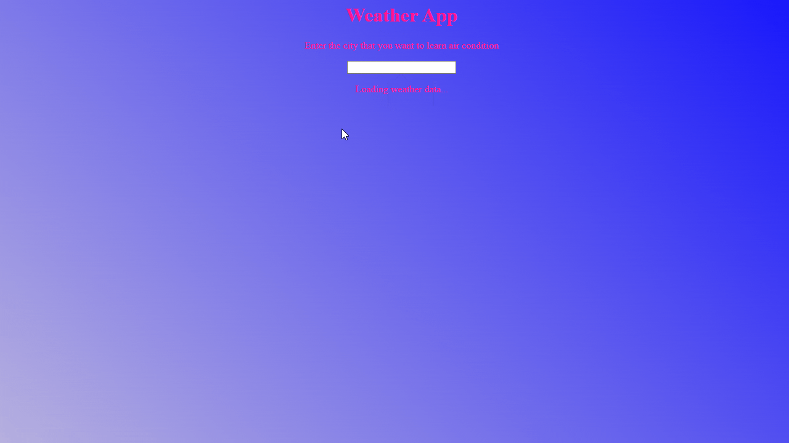
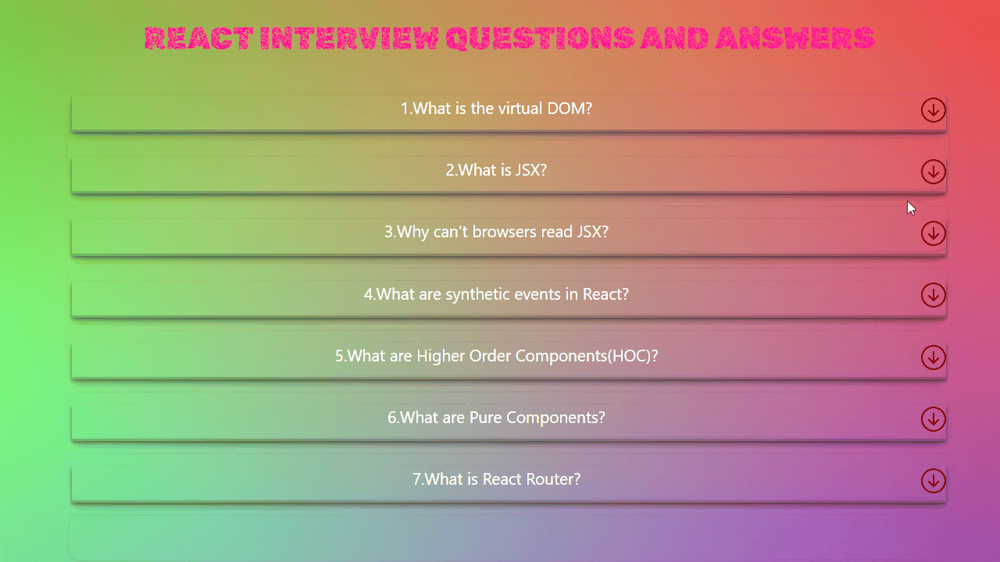

# React-Projects
This repository will be helpfull for the  developers to understand React principles.
 
Anytime you can ask question about the the repository.

## Portfolio
Tecnologies: React  Sass and react router dom
 React Rooters

 
Open your browser and visit [Demo Link] (https://.netlify.app) to view the app.
 

## IP_Finder
Tecnologies: React  Bootrap Axios 
useContext and  react-rooter-dom

 
Open your browser and visit [Demo Link] (https://ipfinderorigin.netlify.app) to view the app.
 

## LoginLogout Website
Tecnologies: React  Bootrap Axios 
react-router-dom   and ContextApi

 
Open your browser and visit [Demo Link] (https://loginlogout12.netlify.app) to view the app.
 

## Product List
Tecnologies: React  Bootrap Axios 
UseEffect and UseState and useParams and React Rooters

 
Open your browser and visit [Demo Link] (https://productionlist.netlify.app) to view the app.
 

## Tutorial App
Tecnologies: React  Bootrap Axios 
UseEffect and UseState

 
Open your browser and visit [Demo Link] (https://tutorialapporigin.netlify.app) to view the app.
 

## Appointment App
Technologies : React SASS Bootstrap
 
Open your browser and visit [Demo Link] (https://appointmentapp12.netlify.app) to view the app.
#### Second link is getting information from App1.js , App1.css and Components-1.
#### Basically latest version of the App.
####  If you click double the appointment box, then you will see the consulted sign
Open your browser and visit [Demo Link] (https://appointmentappversionlast.netlify.app) to view the app.

  

 

## Todo App
Tecnologies: React CSS
 
Open your browser and visit [Demo Link] ((https://todoapporigin.netlify.app) to view the app.
 

## NBA -All Starts
Tecnologies: React SASS Bootrap
 
Open your browser and visit [Demo Link] (https://nbalegendapp.netlify.app) to view the app.
  

 

## Horoscope
Technologies: React SASS.module 
 
Open your browser and visit [Demolink] (https://horoscope12.netlify.app) to view the app
  

 

## Weather Api

Technologies: React 
 
 Open your browser and visit  [Demo Link] (https://weatherprognoise.netlify.app)

  

 

## Quizz App
Technologies: React SASS Bootrap
 
Open your browser and visit [Demo Link] (https://quizzapp12.netlify.app) to view the app.
 

